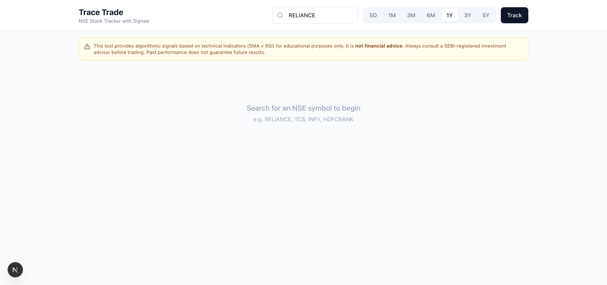
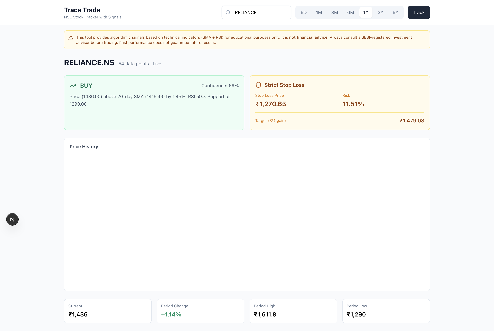

# Trace Trade — NSE Stock Tracker

Next.js web app to track NSE (India) stocks across multiple timeframes with algorithmic buy/sell signals and strict stop-loss calculation.

## Features

- Search any NSE symbol (RELIANCE, TCS, INFY, etc.)
- Timeframes: 5D, 1M, 3M, 6M, 1Y, 3Y, 5Y
- Recharts area chart with gradient fill
- SMA + RSI signal engine (BUY/SELL/NEUTRAL)
- Strict stop-loss (fixed price, not trailing)
- Mobile-responsive dashboard
- Redis caching via Upstash (15min TTL)
- Financial disclaimer on every view

## Screenshots

### Homepage


### RELIANCE 1Y Signal


## Tech Stack

| Layer | Technology |
|---|---|
| Framework | Next.js 15 (App Router) |
| Language | TypeScript |
| Styling | Tailwind CSS |
| Charts | Recharts |
| Data Source | Yahoo Finance API |
| Cache | Upstash Redis |
| Deploy | Vercel |

## Local Development

```bash
npm install
# Add .env.local (see .env.example)
npm run dev
```

Open [http://localhost:3000](http://localhost:3000).

## Environment Variables

```bash
UPSTASH_REDIS_REST_URL=      # Required for caching
UPSTASH_REDIS_REST_TOKEN=    # Required for caching
```

Optional: `ALPHA_VANTAGE_API_KEY` for fallback data source.

## Deployment

### Vercel (Recommended)

1. Push to GitHub
2. Import repo in [Vercel dashboard](https://vercel.com)
3. Add environment variables in Project Settings → Environment Variables
4. Deploy

### GitHub Actions CI

`ci.yml` runs on every push/PR to `main`: lint, type-check, tests, and build verification. This catches errors before Vercel's own build. No deploy workflow needed — Vercel auto-deploys on `git push` via its native Git integration.

## API

### GET /api/stocks/{symbol}/history?period={period}

| Parameter | Values |
|---|---|
| `symbol` | Any NSE ticker (case-insensitive) |
| `period` | `5d`, `1mo`, `3mo`, `6mo`, `1y`, `3y`, `5y` |

**Response:**

```json
{
  "meta": {
    "symbol": "RELIANCE.NS",
    "period": "1y",
    "dataPoints": 52,
    "cached": false
  },
  "data": [...],
  "signal": {
    "action": "BUY",
    "confidence": 72,
    "reason": "Price (2867.00) above 20-day SMA (2845.30)...",
    "stopLoss": 2831.85,
    "stopLossType": "strict",
    "stopLossPercent": 1.22,
    "targetPrice": 2953.01
  }
}
```

## Disclaimer

This tool provides algorithmic signals based on technical indicators (SMA + RSI) **for educational purposes only**. It is **not financial advice**. Always consult a SEBI-registered investment advisor before trading. Past performance does not guarantee future results.

## License

MIT
